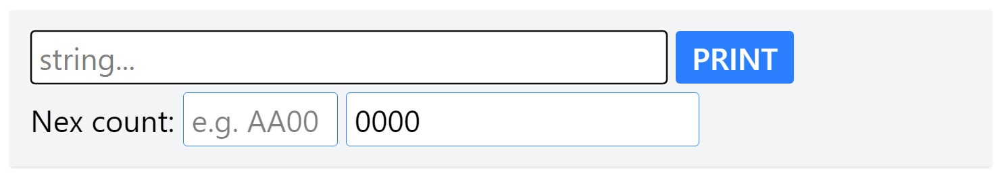

# Replication COUNTER

## About
- This is a simple barcode replication and counter.
- It uses the following technologies:
  - PHP 8
    - flightphp
    - mike42/escpos-php
    - vlucas/phpdotenv
  - Node.js (Development environment only)
    - Tailwind CSS v4
    - postcss
    - autoprefixer

## Installation

- Clone the repository
- Edit .env.example to .env
- Update .env to match your environment(.env)
    - `PRINT_TITLE = "Replication COUNTER"`
        - Used for application title or print title

    - `COUNTER_PREFIX = "ABCD"`
        - Used for ticket number print mode, If not set, no prefix
        - Setting the prefix letter of the ticket number
        - Maximum character length is up to 4 characters

    - `TIMEZONE = "Asia/Tokyo"`
        - set for your timezone
    - `DATETIME_FORMAT = "Y-m-d H:i:s"`
        - set for your datetime format (print format: 2025-02-09 08:50:21)

    - `PRINTER_PATH = "/dev/usb/lp1"`
        - Used for printer path
    - `PRINTER_MODEL = "CT-S651"`
        - Used for printer model
        - refer to the website for available models. [mike42/escpos-php](https://github.com/mike42/escpos-php) 

- Run the command and your action below
    - `composer install` 
    - `npm install`
    - `npm run`
    - `php -S localhost:8000 -t ./`
    - Open the URL ([http://localhost:8000/](http://localhost:8000/)) in your browser, It will print if there is no problem with the settings.

## How to use

- filed `string...` : string
    - Text to print output as QR Code.
    - If not set, QR Code will be not print.

- filed `e.g. AA00`: prefix
    - Text to print output as ticket number prefix
    - Maximum character length is up to 4 characters
    - Uppercase letters only.
    - If not set, ticket number will be printed without prefix

- filed `0000`: counter
    - Text to print output as ticket number
    - Greater than `0001` set, ticket number will be printed.
    - 4 digits with leading zero with Barcode(code39)
    - If `0000` set, ticket number will not be printed.

- `PRINT` button
    - Click the button to print.

> [!TIP]
> QR Code is a registered trademark of DENSO WAVE INCORPORATED.

## Print Contents
> [!NOTE]
> TITLE and TIMESTAMP(Y-m-d H:i:s) are always printed !

| | isset | not set | 
| --- | --- | --- | 
| string | QRCode + TEXT | (none) | 
| prefix | Barcode + prefix + counter  [AA00-0123] | counter [0123] |
| counter | Barcode + counter [0123] | (none) |
| all fields | QRCode + TEXT + Barcode + prefix + counter| (none) |

## Lisence
- MIT Lisence
